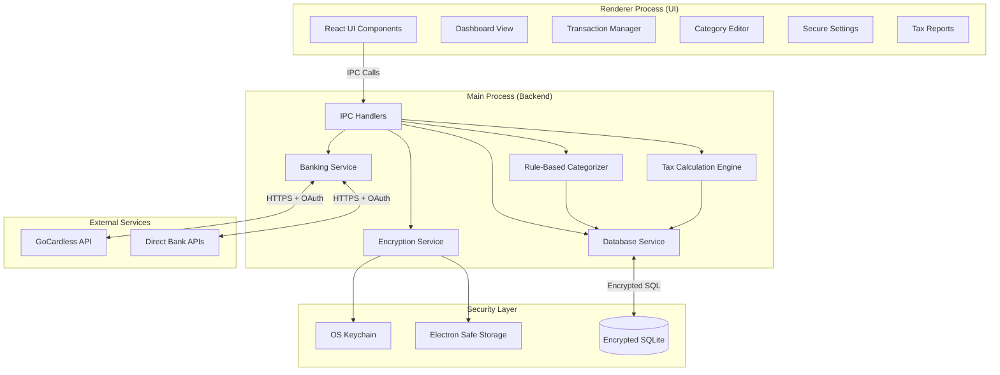
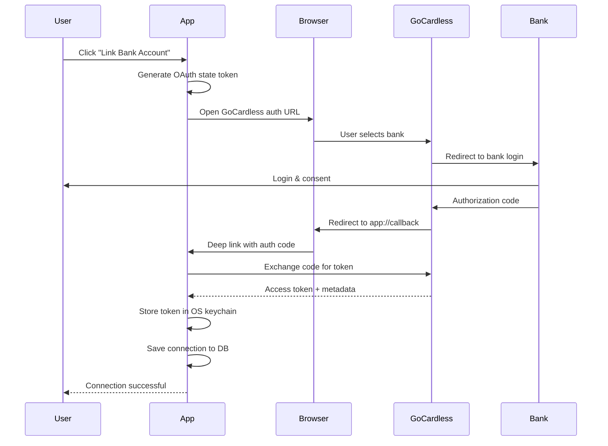
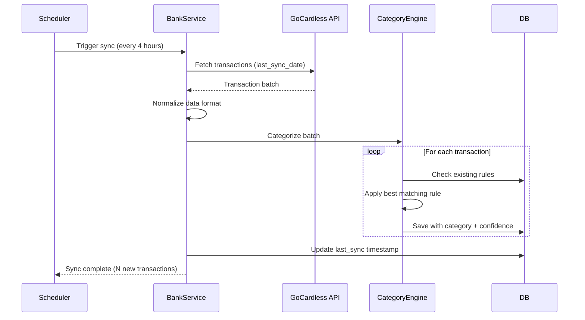
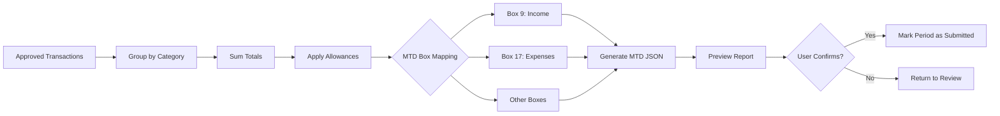

# MTD Master - Revised Architecture & Implementation Plan
**Focus: Bulletproof Bookkeeping First, AI Assistance Second**

## 1. Project Overview
**MTD Master** is a standalone, privacy-focused Windows Electron application designed to simplify UK Making Tax Digital (MTD) tax return process. It prioritizes **security, reliability, and accurate bookkeeping** over flashy AI features.

### Core Philosophy
1. **Security First**: All financial data encrypted at rest
2. **Reliability**: Rock-solid transaction management and categorization
3. **Privacy**: All data stays local, user controls everything
4. **Compliance**: MTD-ready outputs, HMRC formula compliance
5. **AI as Assistant**: AI suggests, never decides (Phase 3+)

## 2. Technology Stack

### Core Platform
- **Framework**: Electron 28+ (Cross-platform desktop)
- **Frontend**: React 18, TypeScript 5, Vite 5
- **Styling**: Tailwind CSS 3 (Modern, responsive UI)
- **State Management**: Zustand (lightweight, TypeScript-friendly)

### Backend (Local)
- **Runtime**: Node.js (Electron Main Process)
- **Database**: **SQLCipher** (encrypted SQLite) via `@journeyapps/sqlcipher`
- **ORM**: Drizzle ORM (type-safe, lightweight)
- **Process Manager**: Better-sqlite3 for synchronous DB operations

### Security Layer
- **Encryption**: 
  - SQLCipher with AES-256 encryption
  - Electron's `safeStorage` API for credentials
  - OS keychain integration (Windows Credential Manager)
- **Secrets**: Never store API keys in database
- **Memory**: Secure memory handling, auto-lock after inactivity

### Integration APIs
- **Open Banking**: GoCardless Bank Account Data API (primary)
- **Fallback**: Direct bank APIs (Monzo, Starling, etc.) via OAuth2

### Future AI (Phase 3+)
- **Optional Cloud**: OpenAI API (with user consent only)
- **Local Option**: Ollama + Phi-3 Mini (lightweight, 3.8B params)
- **Rule Engine**: Decision trees for categorization (Phase 2)

## 3. System Architecture

### High-Level Design


### Data Schema (Encrypted SQLite)

```sql
-- Core Tables
CREATE TABLE settings (
    id INTEGER PRIMARY KEY,
    key TEXT UNIQUE NOT NULL,
    value TEXT NOT NULL,          -- Encrypted sensitive values
    type TEXT DEFAULT 'string',   -- string, json, encrypted
    updated_at DATETIME DEFAULT CURRENT_TIMESTAMP
);

CREATE TABLE bank_connections (
    id TEXT PRIMARY KEY,          -- UUID
    provider TEXT NOT NULL,       -- 'gocardless', 'monzo', etc.
    account_name TEXT NOT NULL,
    account_id TEXT NOT NULL,     -- External provider ID
    status TEXT NOT NULL,         -- 'active', 'expired', 'revoked'
    metadata TEXT,                -- JSON: last_sync, etc.
    created_at DATETIME DEFAULT CURRENT_TIMESTAMP,
    expires_at DATETIME
);

CREATE TABLE transactions (
    id TEXT PRIMARY KEY,          -- UUID
    bank_connection_id TEXT NOT NULL,
    transaction_date DATE NOT NULL,
    amount DECIMAL(10,2) NOT NULL,
    currency TEXT DEFAULT 'GBP',
    description TEXT NOT NULL,
    merchant TEXT,                -- Cleaned merchant name
    category_id INTEGER,
    tax_status TEXT DEFAULT 'pending', -- pending, approved, excluded
    business_percentage INTEGER DEFAULT 100, -- For split expenses
    notes TEXT,
    metadata TEXT,                -- JSON: original data, etc.
    created_at DATETIME DEFAULT CURRENT_TIMESTAMP,
    updated_at DATETIME DEFAULT CURRENT_TIMESTAMP,
    FOREIGN KEY (bank_connection_id) REFERENCES bank_connections(id),
    FOREIGN KEY (category_id) REFERENCES categories(id)
);

CREATE TABLE categories (
    id INTEGER PRIMARY KEY AUTOINCREMENT,
    name TEXT UNIQUE NOT NULL,
    type TEXT NOT NULL,           -- 'income', 'expense'
    tax_category TEXT NOT NULL,   -- MTD box mapping
    icon TEXT,
    color TEXT,
    is_system INTEGER DEFAULT 0,  -- System vs user-created
    keywords TEXT,                -- JSON array for matching
    created_at DATETIME DEFAULT CURRENT_TIMESTAMP
);

CREATE TABLE categorization_rules (
    id INTEGER PRIMARY KEY AUTOINCREMENT,
    pattern TEXT NOT NULL,        -- Regex or keyword
    pattern_type TEXT DEFAULT 'keyword', -- keyword, regex, merchant
    category_id INTEGER NOT NULL,
    confidence INTEGER DEFAULT 80, -- 0-100 confidence score
    priority INTEGER DEFAULT 50,   -- Higher = checked first
    is_active INTEGER DEFAULT 1,
    learned INTEGER DEFAULT 0,     -- User corrections become rules
    created_at DATETIME DEFAULT CURRENT_TIMESTAMP,
    FOREIGN KEY (category_id) REFERENCES categories(id)
);

CREATE TABLE tax_periods (
    id INTEGER PRIMARY KEY AUTOINCREMENT,
    name TEXT NOT NULL,           -- e.g., "Q1 2024/25"
    start_date DATE NOT NULL,
    end_date DATE NOT NULL,
    status TEXT DEFAULT 'active', -- active, submitted, archived
    mtd_submission_id TEXT,       -- HMRC reference
    metadata TEXT,                -- JSON: totals, calculations
    created_at DATETIME DEFAULT CURRENT_TIMESTAMP,
    submitted_at DATETIME
);

CREATE TABLE allowances (
    id INTEGER PRIMARY KEY AUTOINCREMENT,
    tax_period_id INTEGER NOT NULL,
    type TEXT NOT NULL,           -- 'home_office', 'mileage', 'capital_allowance'
    description TEXT NOT NULL,
    amount DECIMAL(10,2) NOT NULL,
    supporting_data TEXT,         -- JSON: calculations, answers
    created_at DATETIME DEFAULT CURRENT_TIMESTAMP,
    FOREIGN KEY (tax_period_id) REFERENCES tax_periods(id)
);

-- Indexes for performance
CREATE INDEX idx_transactions_date ON transactions(transaction_date);
CREATE INDEX idx_transactions_category ON transactions(category_id);
CREATE INDEX idx_transactions_status ON transactions(tax_status);
CREATE INDEX idx_transactions_bank ON transactions(bank_connection_id);
```

## 4. Security Architecture

### Encryption Layers
1. **Database Encryption**: SQLCipher with user-derived master key
2. **Credential Storage**: OS keychain for API tokens
3. **Memory Protection**: Clear sensitive data after use
4. **Auto-lock**: After 15 mins inactivity (configurable)

### Authentication Flow
```
User Opens App
    ↓
Master Password Required (First Time Setup)
    ↓
Derive Encryption Key (PBKDF2, 100k iterations)
    ↓
Unlock SQLCipher Database
    ↓
Load API Keys from OS Keychain
    ↓
App Ready
```

### Data Protection
- **At Rest**: AES-256 encryption via SQLCipher
- **In Transit**: HTTPS only for all API calls
- **In Memory**: Minimal exposure, cleared after operations
- **Backups**: Encrypted exports only

## 5. Key Workflows

### Workflow 1: Bank Connection (OAuth2)


### Workflow 2: Transaction Sync & Categorization


### Workflow 3: Manual Review & Approval
```
User opens Transactions page
    ↓
Filter: Show "Pending" + "Low Confidence" (<70%)
    ↓
Review each transaction:
    - View suggested category
    - Change if incorrect
    - Set business % (for split expenses)
    - Add notes
    ↓
Mark as "Approved"
    ↓
System learns: Create rule from correction
```

### Workflow 4: Tax Calculation (Rule-Based)


## 6. Implementation Phases

### Phase 1: Foundation (Weeks 1-3) ✅ **PRIORITY**
**Goal: Bulletproof core with bank integration and security**

- [x] Project setup (Electron + Vite + React + TypeScript)
- [ ] Security layer implementation
  - [ ] SQLCipher integration with Drizzle ORM
  - [ ] Master password setup flow
  - [ ] OS keychain integration (Windows Credential Manager)
  - [ ] Auto-lock mechanism
- [ ] Database schema creation
  - [ ] All tables with proper indexes
  - [ ] Migration system setup
- [ ] Settings page (encrypted storage)
  - [ ] API key management (GoCardless)
  - [ ] Tax year configuration
  - [ ] Business details
- [ ] Basic UI shell
  - [ ] Navigation sidebar
  - [ ] Route structure
  - [ ] Error boundary components

**Success Criteria:**
- App launches and requires master password
- Settings can be saved and retrieved securely
- Database is encrypted and inaccessible without password

### Phase 2: Banking & Transactions (Weeks 4-6)
**Goal: Rock-solid bank connection and transaction management**

- [ ] GoCardless integration
  - [ ] OAuth2 flow (browser → deep link)
  - [ ] Token refresh logic
  - [ ] Error handling (expired tokens, rate limits)
  - [ ] Account selection UI
- [ ] Transaction fetching
  - [ ] Initial bulk import
  - [ ] Incremental sync (scheduled)
  - [ ] Duplicate detection
  - [ ] Data normalization
- [ ] Transaction viewer
  - [ ] Filterable data grid (React Table v8)
  - [ ] Search functionality
  - [ ] Bulk operations (categorize, approve)
  - [ ] Export to CSV/Excel
- [ ] Manual transaction entry (for cash/missing data)

**Success Criteria:**
- User can link bank account via GoCardless
- Transactions sync automatically every 4 hours
- Transaction grid is fast (virtualized, handles 10k+ rows)
- No data corruption or missing transactions

### Phase 3: Categorization Engine (Weeks 7-8)
**Goal: Accurate, fast, rule-based categorization**

- [ ] Core category system
  - [ ] Seed default categories (aligned with MTD)
  - [ ] CRUD UI for custom categories
  - [ ] Category icons and colors
- [ ] Rule-based engine
  - [ ] Keyword matching (fast path)
  - [ ] Regex rules (advanced users)
  - [ ] Merchant name normalization
  - [ ] Priority-based rule selection
- [ ] Learning system
  - [ ] User corrections → new rules
  - [ ] Confidence scoring
  - [ ] Rule suggestion UI
- [ ] Bulk categorization
  - [ ] Apply rules to all pending
  - [ ] Undo/redo operations

**Success Criteria:**
- 80%+ of common transactions categorized automatically
- User corrections improve accuracy over time
- Categorization happens in <100ms per transaction
- Clear visibility into which rule matched

### Phase 4: Tax Calculation (Weeks 9-10)
**Goal: HMRC-compliant tax calculations**

- [ ] Tax period management
  - [ ] Create/edit quarterly periods
  - [ ] Period selection UI
  - [ ] Archive old periods
- [ ] Allowances system
  - [ ] Home office use calculator
  - [ ] Mileage allowance tracker
  - [ ] Capital allowances (simplified)
- [ ] MTD box mapping
  - [ ] Income (Box 9)
  - [ ] Expenses by category (Box 17+)
  - [ ] Adjustments
- [ ] Calculation engine
  - [ ] Sum by category and period
  - [ ] Apply percentage splits
  - [ ] Deduct allowances
  - [ ] Validate totals

**Success Criteria:**
- Calculations match HMRC formulas exactly
- Easy to add common allowances
- Clear audit trail (how numbers were calculated)
- Export MTD-ready JSON format

### Phase 5: Reports & Dashboard (Weeks 11-12)
**Goal: Clear insights and MTD submission preparation**

- [ ] Dashboard implementation
  - [ ] Income vs Expenses chart (by period)
  - [ ] Category breakdown (pie/bar charts)
  - [ ] Tax estimate (using current tax bands)
  - [ ] Sync status indicators
- [ ] Tax report generator
  - [ ] Period summary view
  - [ ] Category-by-category breakdown
  - [ ] Supporting documents list
  - [ ] PDF export for records
- [ ] MTD JSON export
  - [ ] Validate format
  - [ ] Preview before export
  - [ ] Save submission records

**Success Criteria:**
- Dashboard loads in <1s
- Reports accurately reflect database state
- MTD JSON passes HMRC validation
- PDF reports are professional-quality

### Phase 6: Polish & Release (Weeks 13-14)
**Goal: Production-ready Windows application**

- [ ] UI/UX refinement
  - [ ] Keyboard shortcuts
  - [ ] Loading states
  - [ ] Empty states
  - [ ] Error messages
  - [ ] Help tooltips
- [ ] Performance optimization
  - [ ] Database query optimization
  - [ ] React rendering optimization
  - [ ] Lazy loading
- [ ] Packaging
  - [ ] Electron Builder config
  - [ ] Code signing (optional Phase 1)
  - [ ] Auto-updater setup
  - [ ] `.exe` installer
- [ ] Testing
  - [ ] Unit tests (critical paths)
  - [ ] Integration tests (bank flow)
  - [ ] Manual QA checklist
- [ ] Documentation
  - [ ] User guide
  - [ ] Installation instructions
  - [ ] Troubleshooting

**Success Criteria:**
- App installs and runs on fresh Windows 10/11
- No crashes in normal operation
- Professional, polished UI
- Clear user documentation

## 7. Future Enhancements (Phase 7+)

### AI-Assisted Categorization (Optional)
**Only after Phase 6 is stable**

- [ ] Cloud AI option (OpenAI API with user consent)
  - [ ] Category suggestions for ambiguous transactions
  - [ ] Natural language transaction search
  - [ ] Spending insights
- [ ] Local AI option (Ollama + Phi-3 Mini)
  - [ ] Lightweight model (~2GB)
  - [ ] Runs locally for privacy
  - [ ] Fallback to rules if unavailable

### Multi-Account Support
- [ ] Link multiple bank accounts
- [ ] Consolidated view
- [ ] Per-account settings

### Advanced Features
- [ ] Receipt scanning (OCR)
- [ ] Invoice generation
- [ ] VAT tracking (for VAT-registered users)
- [ ] Multi-user (accountant access)

## 8. Non-Functional Requirements

### Performance Targets
- **Database**: Queries <50ms for 10k transactions
- **UI**: 60 FPS animations, <100ms interactions
- **Sync**: Process 1000 transactions in <5s
- **Startup**: App ready in <2s (after password)

### Security Requirements
- **Encryption**: AES-256 for database
- **Authentication**: Master password with key derivation
- **Session**: Auto-lock after 15 mins (configurable 5-60)
- **Backup**: Export with encryption, password-protected
- **Audit**: Log all financial data changes

### Reliability Requirements
- **Uptime**: Offline-first (works without internet after sync)
- **Data Integrity**: Transaction checksums, sync verification
- **Error Recovery**: Auto-retry failed syncs (with backoff)
- **Backups**: Auto-backup before major operations

### Compliance Requirements
- **MTD**: Output format matches HMRC specifications
- **GDPR**: User owns data, can export/delete all
- **Audit Trail**: Full history of categorizations and changes

## 9. Risk Mitigation

| Risk | Impact | Mitigation |
|------|--------|------------|
| **GoCardless API changes** | High | Abstract API layer, version pinning, monitor changelog |
| **Data corruption** | Critical | SQLite transactions, checksums, regular backups |
| **Security breach** | Critical | SQLCipher encryption, OS keychain, security audit |
| **Performance issues** | Medium | Virtualized lists, indexed queries, profiling |
| **User data loss** | High | Auto-backup, export functionality, cloud backup option (future) |
| **AI hallucinations (future)** | High | AI suggests only, never decides, clear disclaimers |
| **Legal liability** | High | Clear "not tax advice" disclaimers, recommend accountant review |

## 10. Success Metrics

### User Success
- User links bank account in <2 mins
- 90%+ categorization accuracy after 1 month of corrections
- MTD submission in <15 mins (vs 2-4 hours manual)
- Zero data loss incidents

### Technical Success
- <5% error rate in bank syncs
- <100ms average transaction query time
- No security vulnerabilities in external audit
- 99%+ uptime (offline-capable)

## 11. Legal & Compliance Disclaimer

**CRITICAL**: This software is a **bookkeeping tool**, not a tax advisor.

- Add prominent disclaimer in app and documentation
- Recommend users consult qualified accountant
- MTD calculations based on HMRC public formulas
- No guarantee of tax optimization accuracy
- User responsible for final submission review

---

## Summary: Why This Plan Works

1. **Security First**: Encrypted database, OS keychain, auto-lock
2. **Proven Tech**: Electron + React + SQLite (battle-tested)
3. **Fast & Reliable**: Rule-based categorization, offline-first
4. **Incremental**: Ship working product, add AI later
5. **Low Risk**: No AI making tax decisions, HMRC formula compliance
6. **User-Focused**: Solves real problem (tedious bookkeeping) simply

**The key insight**: MTD users don't need AI to optimize taxes. They need a **fast, accurate, secure way to organize their transactions** and generate HMRC-compliant reports. AI can help with edge cases, but only after the foundation is rock-solid.